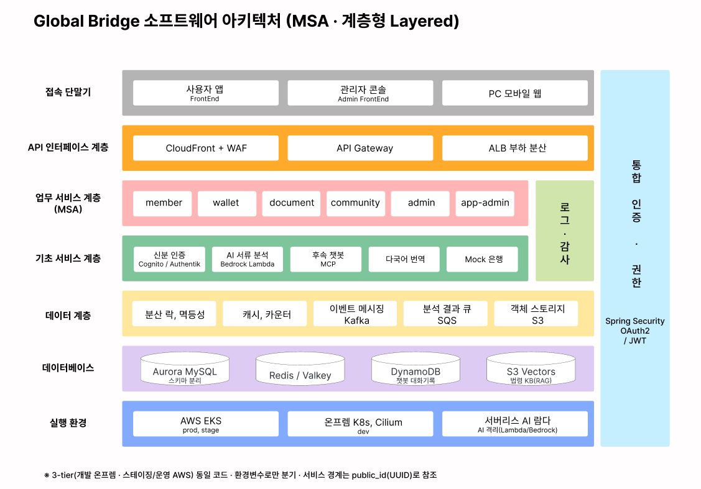

# 🦫 Sangam Beavers

### Building **GlobalBridge** — a financial bridge for migrant workers

외국인 근로자를 위한 **클라우드 금융 플랫폼**을 만드는 팀입니다. 
송금 · 환전 · 커뮤니티, 그리고 AI 계약서 분석까지 — 언어와 제도의 장벽을 넘어 누구나 안전하게 금융을 누리도록.

우리FISA 6기 클라우드 엔지니어링 과정 · 상암 비버즈(Sangam Beavers)

 

---

## 💡 What we build

**GlobalBridge**는 한국에 거주하는 외국인 근로자가 겪는 금융 불편을 해소하기 위한 종합 핀테크 서비스입니다.

국내 체류 외국인 근로자는 약 **110만 명**. 복잡하고 비싼 해외송금, 이해하기 어려운 한국어 계약서, 부족한 생활·비자 정보 — 우리는 이 문제의 본질을 **'신뢰'** 로 정의했습니다. 고객의 신뢰와 서비스의 수익을 지속적으로 보장하려면 *중단 없이 안전한 인프라*가 전제되어야 한다고 판단했고, **고가용성을 설계의 출발점**으로 삼아 온프렘과 AWS를 동일한 빌딩블록으로 구축한 기반 위에 금융 서비스를 올렸습니다.

- 💸 **간편 송금 · 디지털 지갑** — 충전부터 현금화까지, 외부 은행 연동 결제 흐름을 안전하게
- 🤖 **AI 계약서 분석 챗봇** — Bedrock 기반으로 근로계약서를 읽고 핵심 조항·위험 요소를 모국어로 설명
- 🌐 **다국어 커뮤니티** — 게시글·댓글 실시간 번역으로 한국어/영어/베트남어/태국어/필리핀어 등 언어 장벽 없는 소통
- 🛡️ **규제 수준의 신뢰성** — 변경 불가 금융 감사 로그, KYC, 거래 추적과 운영 SLO 관리

---

## ✨ Core Features

가용성부터 보안까지, 금융 서비스가 갖춰야 할 신뢰를 다섯 가지 핵심 기능으로 구현했습니다.

| # | 기능 | 한 줄 설명 |
|:-:|------|-----------|
| 1 | 🟢 **무중단 서비스 (Multi-AZ HA)** | Aurora reader 자동 승격 · Valkey 자동 페일오버 · EKS/NAT 3개 가용영역 분산 — AZ 하나가 통째로 죽어도 송금·환전이 멈추지 않습니다. |
| 2 | 🧠 **MCP 오케스트레이션 AI 챗봇** | LLM이 법령 KB · 환율 · 커뮤니티 · 웹검색(Tavily) **4개 도구를 직접 선택·호출**. 환율·커뮤니티·웹검색은 MCP 표준 인터페이스로 결합해 규약만으로 도구를 확장합니다. |
| 3 | 📄 **서버리스 RAG 서류 분석** | S3 Pre-signed 직접 업로드 → Lambda가 Bedrock VLM **1회 호출로 OCR 추출 + PII 마스킹** 후 원본 즉시 폐기 → 노동법령 Knowledge Bases(RAG)로 위험 조항 등급화·번역. |
| 4 | 🔒 **멱등성 · 분산락 송금/환전** | Redisson MultiLock으로 두 지갑을 `wallet_id` 오름차순 잠금(데드락 방지) + 멱등성 키로 중복·이중차감 차단. 잔액은 캐시 없이 `BigDecimal`로 DB 직접 조회. |
| 5 | 🔑 **OIDC IdP 이중화 인증** | Authentik(개발) / Cognito(운영)를 `AUTH_ISSUER_URI` **단일 환경변수로만 분기** — IdP가 교체돼도 인증 코드는 그대로. JWT `public_id` 클레임으로 전역 사용자 식별 + 2차 인가. |

---

## 🔄 User Journey

가입·인증(회원가입 → 로그인 → 신분증 인증 → 신뢰등급)을 공통 출발점으로, 세 갈래 사용자 기능과 운영자 기능이 하나로 이어집니다. 로그인 후에는 미인증 상태에서도 **AI 서류 분석·챗봇**과 **커뮤니티**를 이용할 수 있고, 신분증 인증(KYC)을 완료하면 **송금·환전**이 열립니다.

  

---

## 🏗️ Architecture

온프렘(vSphere)과 AWS를 **WireGuard 터널 + FRR(BGP)** 로 연결한 하이브리드 구조이며, 운영·스테이징은 각각 **독립된 VPC**로 분리해 다중 가용영역에 분산했습니다.

  

- **온프렘** — vSphere 위 Rocky Linux 9 Kubernetes, pfSense CARP HA 게이트웨이, GitOps(Jenkins·Harbor·ArgoCD·SonarQube)와 보안(Authentik SSO·Vault·ESO), Cilium(eBPF) 네트워킹.
- **AWS** — 엣지(CloudFront·WAF·API Gateway) → Private EKS(ASG 3~9 노드, 다중 AZ). 데이터는 도메인별 Aurora Serverless v2 3 클러스터 + ElastiCache Valkey(3-AZ).
- **네트워킹** — 사이트 간 WireGuard + BGP, 개발자 원격 접속은 Tailscale 메시로 보완. 전 구간 4계층 서브넷(public·private·db·mgmt) 격리.
- **운영 표준** — 모든 자원은 Terraform(IaC) + GitOps(ArgoCD)로 관리하며, 세 환경(개발 온프렘 / 스테이징·운영 AWS)은 동일 코드를 환경변수로만 분기합니다.

#### 🧩 Software Architecture

도메인 단위로 분리한 MSA를 접속 단말기부터 실행 환경까지 계층형(Layered)으로 쌓았습니다. 모든 계층은 Spring Security OAuth2·JWT 통합 인증·권한과 로그·감사가 공통으로 관통하며, 서비스 경계를 넘는 회원 참조는 물리 FK 없이 `public_id`(UUID)로만, 도메인 간 비동기 통신은 Kafka 이벤트로 처리합니다.

  

---

## 📦 Repositories

#### 🖥️ Frontend
| Repo | 설명 | Stack |
|------|------|-------|
| [`frontend`](https://github.com/Sangam-Beavers/frontend) | 외국인 근로자용 모바일 앱 (고객 대면) | React · TypeScript · Vite · i18next |
| [`gb-admin-frontend`](https://github.com/Sangam-Beavers/gb-admin-frontend) | 운영팀용 어드민 콘솔 (금융·사용자·시스템 관리) | React · TypeScript · Recharts |

#### ⚙️ Backend
| Repo | 설명 | Stack |
|------|------|-------|
| [`gb-backend`](https://github.com/Sangam-Beavers/gb-backend) | 핀테크 마이크로서비스 모노레포 (member·wallet·community·document·admin) | Java · Spring Boot · Gradle · MySQL/Aurora |
| [`gb-mock-banks`](https://github.com/Sangam-Beavers/gb-mock-banks) | 외부 은행 모의 서버 (Beaver Bank / Quokka Bank) | Node.js · Express · SQLite · mTLS |

#### 🤖 AI
| Repo | 설명 | Stack |
|------|------|-------|
| [`gb-chatbot-lambda`](https://github.com/Sangam-Beavers/gb-chatbot-lambda) | AI 계약서 분석 챗봇 + 커뮤니티 번역 Lambda | Python · Bedrock · Claude · MCP |
| [`gb-document-lambda`](https://github.com/Sangam-Beavers/gb-document-lambda) | AI 문서 분석 Lambda | Python · Bedrock |
| [`gb-mcp-servers`](https://github.com/Sangam-Beavers/gb-mcp-servers) | 챗봇용 MCP 서버 (환율·커뮤니티 어댑터) | Python · FastAPI · Redis · MySQL |

#### ☁️ Infra & DevOps
| Repo | 설명 | Stack |
|------|------|-------|
| [`cloud-infra-iac`](https://github.com/Sangam-Beavers/cloud-infra-iac) | AWS 인프라 IaC (VPC·EKS·Aurora·KMS) | Terraform · AWS |
| [`gb-infra`](https://github.com/Sangam-Beavers/gb-infra) | 마이크로서비스 Helm 차트 & 배포 매니페스트 | Helm · Kubernetes · ArgoCD |
| [`devops-infra-configs`](https://github.com/Sangam-Beavers/devops-infra-configs) | 온프레미스 K8s 클러스터 구축 가이드 (vSphere) | Kubernetes · Cilium · pfSense |
| [`devops-vpn-configs`](https://github.com/Sangam-Beavers/devops-vpn-configs) | 온프레미스 ↔ AWS Site-to-Site VPN | WireGuard · FRR/BGP |

---

## 🧰 Tech Stack

| 영역 | 기술 |
|------|------|
| **Frontend** | React 19 · TypeScript · Vite · React Query · i18next |
| **Backend** | Java 17 · Spring Boot 3.5 · Gradle · MySQL 8 / Aurora · Redis·Valkey (Redisson 분산락) · Apache Kafka |
| **AI / LLM** | Python 3.12 · AWS Lambda · Amazon Bedrock · Claude (Sonnet 4.6) · Knowledge Bases (S3 Vectors) · MCP · SQS · DynamoDB |
| **Cloud (AWS)** | EKS · Aurora Serverless v2 · ElastiCache(Valkey) · CloudFront·WAF · API Gateway · ALB · Cognito · KMS · CloudTrail |
| **On-prem** | vSphere(CPI·CSI) · Rocky Linux 9 K8s · Cilium(eBPF·Hubble) · pfSense(CARP HA) · Vault(Raft 3노드) · Authentik(SSO) · Harbor |
| **IaC & DevOps** | Terraform · Jenkins · ArgoCD(GitOps) · Helm · SonarQube · Kaniko · External Secrets(ESO) |
| **Networking** | WireGuard · BGP(FRR) · Tailscale · Route53 Resolver |
| **Observability** | Micrometer · Prometheus · Grafana · CloudWatch · CloudTrail |
| **Auth** | Authentik (OIDC) · Cognito (OIDC) |

---

**Sangam Beavers** 🦫 — _bridging people and finance, in every language._

